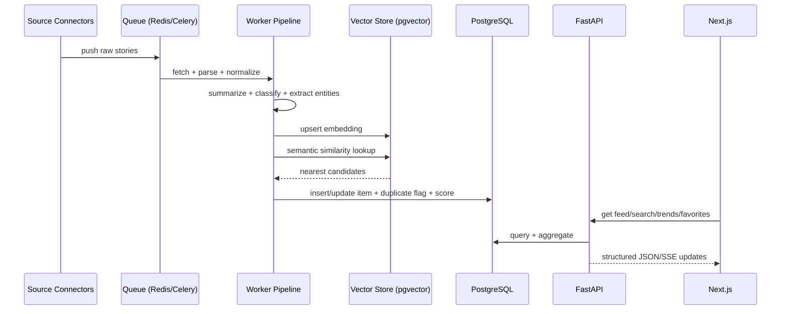

# Data Flow

## Dedup Logic

- Candidate generation via embedding nearest neighbors.
- Duplicate threshold: cosine similarity >= 0.90.
- Tie-breaker priority: source authority > recency > content depth.
