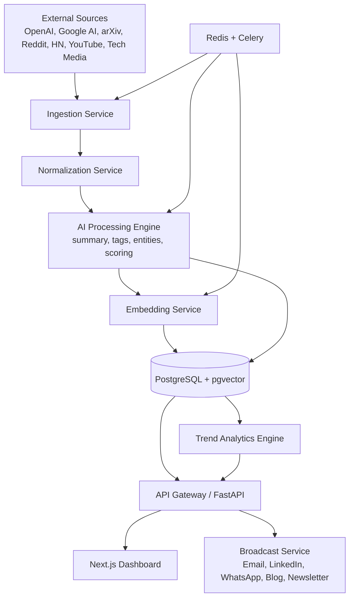

# System Architecture Diagram

## Runtime Components

- API Service: serves news, search, favorites, trends, broadcast endpoints.
- Worker Service: scheduled ingestion, enrichment, deduplication, scoring.
- Database: transactional and analytical storage.
- Redis: queueing and caching.
- Frontend: operator-facing dashboard and controls.
